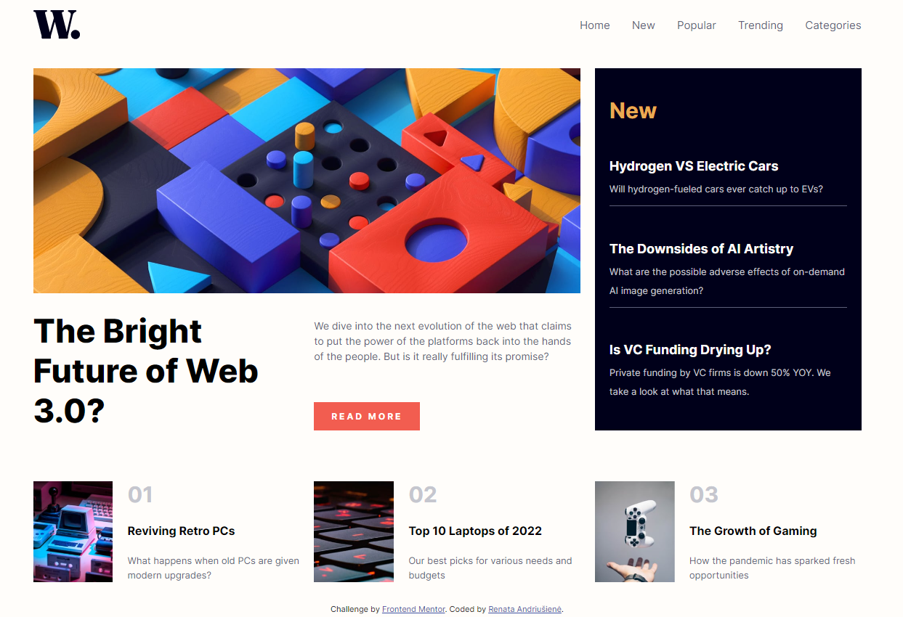

# Frontend Mentor - News homepage solution

This is a solution to the [News homepage challenge on Frontend Mentor](https://www.frontendmentor.io/challenges/news-homepage-H6SWTa1MFl). Frontend Mentor challenges help you improve your coding skills by building realistic projects.

## Table of contents

- [The challenge](#the-challenge)
- [Screenshot](#screenshot)
- [Links](#links)
  - [Built with](#built-with)
  - [What I learned](#what-i-learned)
  - [Continued development](#continued-development)
  - [Useful resources](#useful-resources)
- [Author](#author)

### The challenge

Users should be able to:

- View the optimal layout for the interface depending on their device's screen size
- See hover and focus states for all interactive elements on the page

### Screenshot



### Links

- Solution URL: [https://github.com/An-Renata/news-homepage-main]
- Live Site URL: [https://heroic-snickerdoodle-5830a8.netlify.app/]

### Built with

- Semantic HTML5 markup
- CSS custom properties
- Flexbox
- CSS Grid

### What I learned

Animated CSS hamburger menu. It was a good practice with this one. In the future I'll try new aproaches how could I implement this.

```css
.hamburger-menu.open .bar2 {
  transform: translateX(-35px);
  background: transparent;
}
.hamburger-menu.open .bar1 {
  transform: rotate(45deg) translate(5px, 0);
}
.hamburger-menu.open .bar3 {
  transform: rotate(-45deg) translate(15px, -10px);
}
```

### Continued development

Better handling with hamburger menu and how to style them.
More focus on Grid system to get comfortable with making different layouts.

### Useful resources

- [https://css-tricks.com/snippets/css/complete-guide-grid/] - this is very comprehensive article with everyting in one place. Helps a lot

## Author

- Website - [Renata Andriušienė]
- Frontend Mentor - [@An-Renata]
